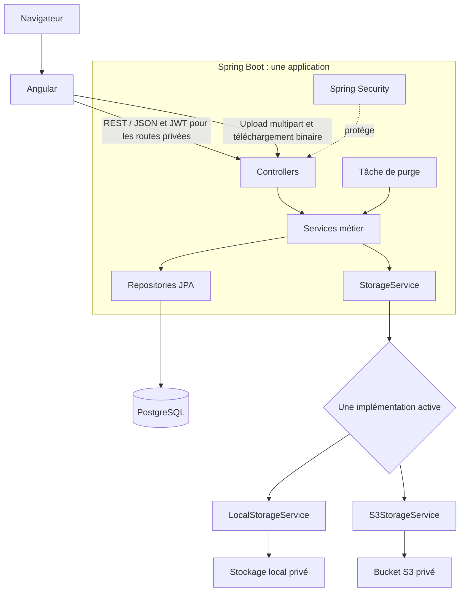
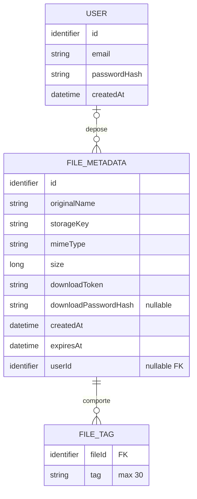
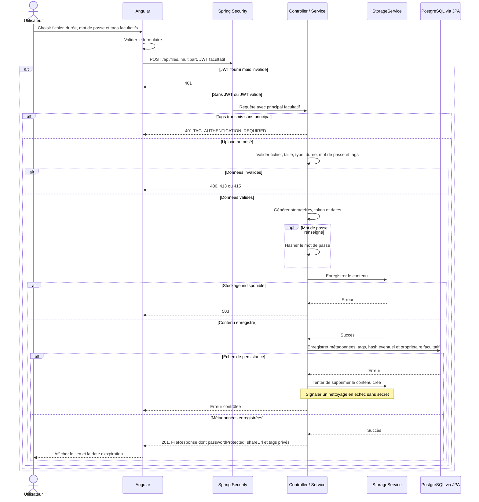
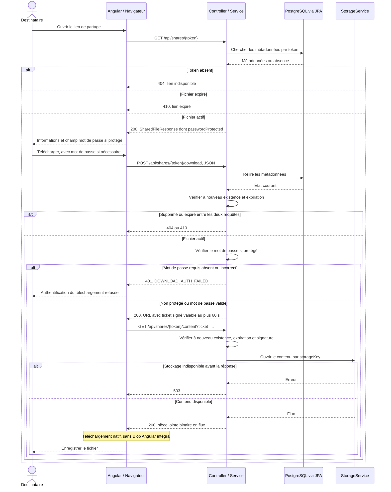

# DataShare — Architecture et conception

> Améliorations de la solution : les mesures de charge, scans et captures antérieurs restent des références historiques.

Dernière révision documentaire : 1er octobre 2026. Ce document décrit la conception retenue et l'état réel de l'application après les user stories et les travaux de qualité.

Il peut se lire à deux niveaux. Les débuts de section expliquent le besoin et les décisions en langage courant ; les tableaux, diagrammes et contrats donnent ensuite le détail utile à une reprise technique. Le périmètre initial couvre les US01 à US06, avec protection facultative des fichiers par mot de passe. Les décisions principales sur l'expiration, les types de fichiers et la suppression du compte sont résumées en section 13.

## 1. Contexte, objectifs et sources

DataShare est une application de transfert temporaire de fichiers destinée aux indépendants et aux petites structures. L'expéditeur dépose un fichier et transmet un lien ; le destinataire peut le télécharger sans créer de compte. Un compte reste utile pour retrouver et supprimer ses propres envois.

Les priorités sont la simplicité, la lisibilité, la fiabilité des parcours et la facilité de maintenance. Les choix techniques restent proportionnés au périmètre actuel de l'application.

### Sources de conception

La conception s'appuie sur les besoins, les spécifications fonctionnelles et techniques ainsi que les maquettes ordinateur et mobile. Ces documents de référence sont conservés séparément du dépôt applicatif. Les choix ajoutés pendant la réalisation sont signalés ci-dessous pour ne pas les confondre avec les demandes initiales.

## 2. Périmètre initial : US01 à US06

Une user story, abrégée **US**, décrit un besoin du point de vue de l'utilisateur. Les six premières forment le socle du produit : créer un compte, envoyer, partager, retrouver et supprimer un fichier.

### Fonctionnalités retenues

| US | Fonctionnalité | Règles retenues à partir des spécifications et de la validation |
|---|---|---|
| US01 | Upload avec compte | Utilisateur authentifié ; un fichier associé à son propriétaire ; stockage ; token unique ; limite de 1 Go ; expiration de 1 à 7 jours, défaut 7 ; mot de passe facultatif d'au moins 6 caractères ; suppression du contenu à expiration et conservation de la ligne de métadonnées pour l'historique |
| US02 | Téléchargement via lien | Destinataire sans compte ; token non prédictible ; métadonnées visibles avant téléchargement ; refus d'un lien invalide ou expiré ; vérification du mot de passe lorsque le fichier est protégé |
| US03 | Création de compte | Email valide et unique ; mot de passe d'au moins 8 caractères ; hash salé ; aucun rôle administrateur ni confirmation par email |
| US04 | Connexion | Email et mot de passe ; émission d'un JWT pour authentifier les requêtes privées |
| US05 | Historique personnel | Nom, taille, date d'envoi, expiration et état du lien ; accès du propriétaire uniquement ; aucun tri ni filtre obligatoire |
| US06 | Suppression | Confirmation côté interface ; contrôle du propriétaire ; suppression physique et suppression des métadonnées ; action irréversible |

La route permettant de récupérer l'utilisateur connecté complète ce périmètre. La déconnexion apparaît dans les maquettes.

Le fonctionnement retenu est un fichier par envoi et par lien. L'objectif général évoque plusieurs fichiers, mais US01 et les formulaires montrent un fichier unique. Aucun transfert groupé, dossier ou archive générée n'est prévu.

### Articulation avec les fonctionnalités avancées

Le MVP reste organisé autour des US01 à US06. Le classement avancé d'US09 et d'US10 ne retire pas les règles de mot de passe et d'expiration déjà présentes dans US01/US02 et dans les maquettes.

| Sujet | Traitement dans cette conception |
|---|---|
| US07 — Upload anonyme | Implémenté après US01 à US06 ; même formulaire et mêmes validations, sans historique ni gestion lorsque le visiteur n'est pas connecté |
| US08 — Tags | Implémentés après US07 ; ajout facultatif pendant l'upload authentifié, 30 caractères maximum par tag, sans doublon par fichier |
| US09 — Protection par mot de passe | Incluse dans US01/US02 ; facultative pour l'expéditeur, mais faisant partie du MVP |
| US10 — Expiration automatique | Expiration incluse via US01 ; blocage du téléchargement, suppression du contenu, conservation des métadonnées possédées pour l'historique et suppression des métadonnées anonymes |

Les tags sont conservés comme une collection de chaînes rattachée à `FileMetadata`. JPA la persiste dans la table technique `FILE_TAG`, sans entité, repository, service ou endpoint dédié. L'upload anonyme réutilise l'endpoint et les services existants, mais ne permet pas d'ajouter des tags.

Aucune gestion de rôles, administration, récupération de mot de passe, notification email ou journal de téléchargements n'est ajoutée. Le profil reste minimal : email du compte et action de suppression définitive.

## 3. Lecture des maquettes et arbitrages

### Écrans et états observés

| Parcours | Éléments visibles |
|---|---|
| Accueil | Logo, bouton d'upload, en-tête « Se connecter » ou « Mon espace » |
| Upload | Sélection d'un fichier, nom et taille, action « Changer », mot de passe optionnel, liste d'expiration |
| Upload invalide | Fichier de 3,1 Go, erreur indiquant la limite de 1 Go, bouton désactivé |
| Upload terminé | Lien généré, texte sur la conservation, bouton de copie sur desktop |
| Inscription | Email, mot de passe, confirmation du mot de passe, navigation vers la connexion |
| Connexion | Email, mot de passe, navigation vers l'inscription |
| Téléchargement | Nom et taille ; mot de passe vide ou saisi ; expiration prochaine ; état expiré sans téléchargement |
| Mes fichiers | Lignes actives et expirées ; filtres Tous/Actifs/Expiré ; cadenas ; Supprimer et Accéder ; ajout de fichiers et déconnexion sur desktop |
| Mobile | Formulaire d'upload en bas de l'écran, menu latéral, menu d'actions par fichier |

La confirmation de suppression exigée par US06 n'est pas dessinée. Les états de chargement, erreur réseau, historique vide et identifiants incorrects doivent être complétés avec les composants existants. Il s'agit d'états nécessaires aux parcours, pas de nouvelles fonctionnalités métier.

### Décisions issues de la lecture des maquettes

| Sujet | Constat | Position |
|---|---|---|
| Ordre de réalisation | Les numéros des US ne sont pas un ordre d'implémentation | Acté : socle, US03, US04, puis fonctionnalités fichiers |
| Upload anonyme | Dessiné avec « Se connecter », mais US07 est avancée | Implémenté après le MVP initial ; l'accueil ouvre `/upload` sans imposer de connexion et le formulaire propose toujours l'accès à la connexion |
| Mot de passe de fichier | US09 avancée, mais règles et champs dans US01/US02 et le SVG | Inclus ; champ facultatif à l'upload, contrôle obligatoire au téléchargement si le fichier est protégé |
| Tags | Mentionnés dans US01, détaillés en US08 ; absents du SVG | Ajoutés de façon discrète au formulaire authentifié et affichés dans l'historique ; ajout uniquement pendant l'upload, sans filtre car celui-ci est facultatif |
| Expiration | Déjà obligatoire dans US01 malgré le classement d'US10 | Choix entiers de 1 à 7 jours, avec 7 par défaut ; le minimum de 1 jour vient d'US10 |
| Historique expiré | La maquette garde le nom des fichiers expirés alors qu'une règle des spécifications demande la suppression des métadonnées | Le contenu est supprimé à l'expiration ; les métadonnées minimales restent dans `FILE_METADATA` jusqu'à leur suppression par l'utilisateur ou la suppression du compte |
| Lien dont les métadonnées ont été supprimées | Le token n'existe plus dans la base | Message « Lien invalide, expiré ou supprimé » ; aucun registre des anciens tokens |
| Informations de l'historique | Taille et date d'envoi demandées par US05, peu ou pas visibles dans le SVG | Ajouter ces informations de façon compacte |
| Identité mobile | Nom « Claire Marie » et avatar sans champs de collecte correspondants | Email et icône générique ; aucune collecte de nom ou de photo |
| Expiration affichée | Le formulaire montre une journée ; le succès annonce une semaine | Valeur initiale de 7 jours et message reflétant la valeur réellement choisie |
| Succès mobile | Le bouton reste « Téléverser » | « Copier le lien », comme sur desktop |
| Taille limite | « 1 Go » sans convention en octets | Convention technique : 1 000 000 000 octets, identiques côté client et serveur |
| Types de fichiers | Exemples interdits `.exe` et `.bat`, complétés par la décision du porteur du projet | Médias, archives et documents usuels acceptés ; exécutables, installateurs et scripts Windows, macOS et Linux refusés selon la politique de la section 10 |

### Expiration et historique : décision retenue

Les maquettes affichent un historique Tous/Actifs/Expirés. Pour rendre ce parcours possible tout en limitant la conservation du contenu, le fichier physique devient immédiatement non téléchargeable à `expiresAt` puis est supprimé du stockage par la tâche de purge. Sa ligne reste dans `FILE_METADATA` avec les seules informations déjà nécessaires à l'historique.

La durée choisie à l'envoi reste comprise entre 1 et 7 jours, avec 7 jours par défaut et comme maximum. Après cette échéance, seul le contenu disparaît. La métadonnée expirée est conservée tant que l'utilisateur souhaite la voir dans son historique ; il peut la supprimer avec US06 et elle disparaît obligatoirement lors de la suppression du compte.

Aucune table `FILE_ARCHIVE`, aucun système d'archivage et aucun soft-delete n'est ajouté. Aucune colonne `status` n'est nécessaire : l'état `ACTIVE` ou `EXPIRED` est calculé depuis `expiresAt`. La suppression répétée d'un contenu déjà absent doit rester sans erreur afin de permettre une nouvelle tentative de purge.

## 4. Stack et justification

| Responsabilité | Choix | Justification |
|---|---|---|
| Frontend | Angular et TypeScript | Composants, routage, formulaires et client HTTP dans un cadre cohérent |
| Backend | Java et Spring Boot | Une API et une logique métier centralisées dans une application |
| Base de données | PostgreSQL | Modèle relationnel minimal, contraintes d'unicité et intégrité des associations |
| Accès aux données | Spring Data JPA | Repositories simples et mapping des deux entités |
| Authentification | Spring Security et JWT | Validation de l'identité et protection des routes privées |
| Documentation API | OpenAPI et Swagger UI | Contrat consultable, schémas et essais des endpoints |
| Stockage | Local et AWS S3, via `StorageService` | Fonctionnement sans compte AWS et même logique métier avec S3 |
| Tests backend | JUnit, Mockito, tests Spring/MockMvc, JaCoCo | Règles métier, contrôleurs, autorisations, intégration et couverture |
| Tests frontend | Outils de tests Angular et Playwright | Composants et parcours de bout en bout |
| Performance | k6 et outils du navigateur | Mesures ciblées sans plateforme de supervision supplémentaire |

Les versions réellement utilisées sont fixées dans `backend/pom.xml` et `frontend/package-lock.json` afin que l'installation reste reproductible.

## 5. Architecture générale

L'application comporte une interface Angular et un backend monolithique Spring Boot. PostgreSQL conserve les métadonnées ; le contenu des fichiers est conservé dans un seul stockage actif.

Le dépôt unique place ces deux applications dans `backend/` et `frontend/`. Le fichier `compose.yaml` situé à la racine construit les deux images et démarre PostgreSQL. La documentation est regroupée dans `docs/`, tandis que `quality/` contient les scripts et résultats des contrôles de qualité.



### Architecture Angular

Les composants sont regroupés par fonctionnalité : authentification, upload, partage/téléchargement et espace personnel. Le composant racine héberge seulement le routeur ; les écrans portent leur navigation, leurs messages et leurs confirmations. Les services, modèles, garde, intercepteur et styles communs sont réutilisés sans créer de bibliothèque de composants visuels supplémentaire.

Les services assurent les appels API, l'état de l'utilisateur courant et la conservation du JWT. Les formulaires effectuent les validations utiles à l'expérience utilisateur. Un intercepteur ajoute le JWT uniquement aux requêtes privées destinées à notre API. Un garde de navigation facilite le parcours vers les pages privées, sans remplacer les contrôles du serveur.

L'état reste local aux composants et services. Aucun gestionnaire d'état supplémentaire n'est nécessaire. Le menu mobile et la disposition desktop utilisent les mêmes données et règles métier.

### Architecture Spring Boot

| Package | Responsabilité |
|---|---|
| `controller` | Routes HTTP, validation d'entrée, réponses |
| `service` | Règles métier, propriété, expiration et coordination base/stockage |
| `repository` | Accès PostgreSQL via Spring Data JPA |
| `entity` | Utilisateur et métadonnées de fichier persistés |
| `dto` | Données reçues et exposées par l'API, sans hashes ni chemins internes |
| `storage` | Contrat léger et implémentations locale/S3 |
| `config` | Spring Security, JWT, OpenAPI, métriques et sélection du stockage |
| `exception` | Traduction centralisée des erreurs en réponses HTTP |

Le chemin principal est `Controller -> Service -> Repository -> PostgreSQL`. Le service métier appelle aussi `StorageService` pour les fichiers. La purge réutilise l'opération de suppression physique du stockage et conserve les métadonnées expirées dans `FILE_METADATA`. La suppression manuelle US06 enlève toujours le contenu et toutes les métadonnées.

Aucune couche ou entité supplémentaire n'est créée pour une évolution hypothétique.

## 6. Stockage local et S3

Le contrat `StorageService` reste limité à l'enregistrement, l'ouverture en lecture et la suppression d'un fichier par clé logique. Le nom original n'est jamais utilisé directement comme chemin de stockage.

| Situation | Comportement cible |
|---|---|
| `STORAGE_TYPE` absent ou égal à `local` | Stockage local, même si des variables AWS sont présentes |
| `STORAGE_TYPE=s3`, configuration complète et accès au bucket valide | S3 uniquement |
| `STORAGE_TYPE=s3`, configuration ou accès au bucket invalide | Arrêt au démarrage avec une erreur exploitable |
| Échec d'une opération S3 | Échec propre de l'opération ; aucun basculement vers le stockage local |

La configuration S3 comprend le bucket, la région et des identifiants accessibles par la configuration sensible ou la chaîne standard AWS. La présence isolée d'identifiants AWS sur la machine ne constitue pas une configuration S3 DataShare. Les paramètres et l'accès au bucket sont vérifiés au démarrage. Le bucket n'est pas rendu public.

Les métadonnées restent dans PostgreSQL dans les deux modes. `storageKey` identifie l'objet indépendamment de son emplacement ; l'URL de partage est construite à partir du token et de l'adresse publique de l'application.

### Cohérence entre base et stockage

Les opérations PostgreSQL et fichier/S3 ne forment pas une transaction atomique commune.

- Upload : valider, stocker le contenu, enregistrer les métadonnées ; si l'enregistrement en base échoue, tenter de supprimer le contenu créé et signaler tout échec de nettoyage.
- Suppression manuelle : supprimer le contenu puis les métadonnées ; si le stockage est indisponible, conserver les métadonnées nécessaires à une nouvelle tentative et retourner une erreur.
- Suppression du compte : vérifier le mot de passe courant, supprimer de façon idempotente tous les contenus encore présents, puis supprimer les métadonnées et l'utilisateur. Si le stockage échoue, conserver le compte et les métadonnées afin que l'utilisateur puisse réessayer ; aucune transaction distribuée n'est revendiquée.
- Une suppression physique répétée doit tolérer un objet déjà absent. Une panne entre les deux suppressions peut laisser des métadonnées sans contenu ; ne pas annoncer une transaction distribuée inexistante.
- Expiration : refuser le téléchargement dès `expiresAt`, indépendamment du succès de la purge. Pour un fichier possédé, supprimer le contenu et conserver la métadonnée destinée à l'historique. Pour un transfert anonyme, supprimer aussi la métadonnée puisqu'aucun historique ne l'utilise. Un échec de nettoyage est signalé et la prochaine purge peut réessayer grâce à `storageKey`.

Ces principes ne nécessitent pas de transaction distribuée, de queue ou de Redis.

Le changement de stratégie au démarrage ne migre pas les fichiers existants. Pour la démonstration, chaque configuration doit utiliser des données cohérentes avec son stockage. Aucune migration automatique ni stratégie par fichier n'est prévue.

## 7. Modèle de données / MCD

Le modèle conserve deux entités métier. Un utilisateur peut déposer zéro à plusieurs fichiers. Un fichier appartient à zéro ou un utilisateur : l'absence de propriétaire représente un transfert anonyme. Un fichier possède zéro à plusieurs valeurs de tag, persistées dans une table de collection JPA.



Ce diagramme représente les entités métier et la collection de tags. Dans le modèle relationnel, l'association utilisateur devient une clé étrangère nullable `FILE_METADATA.user_id`. Une valeur nulle ne crée aucun utilisateur fictif : elle identifie simplement un transfert anonyme. `FILE_TAG` contient `file_id` et `tag`, avec une clé étrangère vers `FILE_METADATA` et une contrainte d'unicité sur la paire. Elle est gérée par `@ElementCollection` et ne correspond pas à une entité métier autonome.

| Donnée ou contrainte | Règle |
|---|---|
| `USER.email` | Obligatoire, format valide, unicité en base |
| `passwordHash` | Hash salé ; jamais retourné par l'API |
| `originalName` | Nom destiné à l'affichage et au téléchargement, traité comme une entrée non fiable |
| `storageKey` | Unique, générée par le serveur, distincte du nom et du token public |
| `mimeType` | Type retenu après les contrôles de fichier ; ne pas faire confiance au seul en-tête client |
| `size` | Nombre réel d'octets |
| `downloadToken` | Unique, aléatoire et non prédictible ; ne donne aucun droit de gestion |
| `downloadPasswordHash` | Nullable ; hash salé du mot de passe de téléchargement ; jamais retourné par l'API |
| Dates | Déterminées par le serveur ; instants stockés en UTC et sérialisés en ISO 8601 |
| `expiresAt` | Calculé à l'envoi à partir de la durée validée |
| `FILE_TAG.tag` | Texte libre nettoyé de ses espaces extérieurs, 30 caractères maximum ; unicité par fichier vérifiée sans tenir compte de la casse |

L'état actif/expiré, la durée restante et l'URL de partage sont calculables et ne sont pas stockés. `passwordProtected` est également calculé : il vaut `true` si `downloadPasswordHash` est présent, et `false` s'il est nul. La confirmation du mot de passe d'inscription appartient au formulaire, pas à la base.

Après expiration, la ligne d’un transfert possédé conserve les métadonnées nécessaires à l’historique. `content_deleted` indique si la suppression physique a réussi ; ce champ technique évite une suppression répétée. L’état du lien reste calculé avec `expiresAt`, indépendamment du délai de purge. Les métadonnées anonymes sont supprimées après leur contenu.

Aucune entité Role, Permission, Session, Tag, AuditLog ou DownloadLog n'est prévue. La table `FILE_TAG` persiste uniquement la collection de chaînes portée par `FileMetadata`.

## 8. Contrat d'interface validé

### Conventions

Le contrat comporte onze endpoints métier. Il couvre l'authentification, la suppression du compte, l'upload avec ou sans compte, la gestion des fichiers du propriétaire et le partage public avec protection facultative par mot de passe.

- Routes privées : `Authorization: Bearer <JWT>` ; aucun `userId` reçu pour déterminer la propriété.
- Requêtes et réponses de données : `application/json`.
- Upload : `multipart/form-data` ; laisser le navigateur construire le boundary.
- GET et `DELETE /api/files/{id}` : aucun corps de requête. `DELETE /api/users/me` reçoit un corps JSON contenant le mot de passe courant.
- Dates : ISO 8601 ; tailles : octets ; identifiants : valeurs opaques pour le frontend.
- Réponses privées, informations de partage et téléchargement : `Cache-Control: no-store`.
- Erreurs : JSON homogène `{code, message, fieldErrors?}`, sans secret ni stack trace.
- Les erreurs métier anticipées utilisent `ApiError` ; une indisponibilité du stockage est traduite en `503`. Les réponses inattendues ne garantissent pas ce format, mais n'exposent pas de stack trace. Une erreur après le début du flux de téléchargement interrompt celui-ci sans pouvoir le remplacer par du JSON.

### Structures de réponse

| Structure | Champs |
|---|---|
| `UserResponse` | `id`, `email`, `createdAt` |
| `LoginResponse` | `accessToken`, `tokenType` égal à `Bearer`, `expiresAt` en ISO 8601 et `user` (`UserResponse`) |
| `FileResponse` | `id`, `originalName`, `mimeType`, `size`, `createdAt`, `expiresAt`, `passwordProtected`, `shareUrl`, `status` calculé, `tags` privés |
| `SharedFileResponse` | `originalName`, `mimeType`, `size`, `expiresAt`, `passwordProtected` |
| `DownloadAccessResponse` | `downloadUrl`, `expiresAt` de l'autorisation temporaire |

`storageKey` et les hashes ne sont exposés dans aucune réponse, même privée. Les informations du propriétaire ne sont pas exposées au destinataire. Le token apparaît uniquement là où le partage l'exige, notamment dans `shareUrl`. Le `status` privé vaut `ACTIVE` ou `EXPIRED` à partir de `expiresAt`, tant que la ligne existe ; cela ne présume pas de sa conservation après expiration.

### Endpoints métier

| Méthode / route | Accès et objectif | Paramètres / requête | Succès | Erreurs principales |
|---|---|---|---|---|
| `POST /api/auth/register` | Public ; créer le compte | JSON `{email, password}` | `201`, `UserResponse` | `400` validation ; `409 EMAIL_ALREADY_USED` |
| `POST /api/auth/login` | Public ; ouvrir l'accès authentifié | JSON `{email, password}` | `200`, `LoginResponse` | `400` format ; `401 INVALID_CREDENTIALS` sans préciser si l'email existe |
| `GET /api/auth/me` | Authentifié ; récupérer l'utilisateur du JWT | Aucun paramètre ni corps | `200`, `UserResponse` | `401` identité absente, invalide, expirée ou compte inexistant |
| `DELETE /api/users/me` | Authentifié ; supprimer définitivement son compte | JSON `{password}` après double confirmation dans l'interface | `204`, aucun contenu | `400` format ; `401 INVALID_CREDENTIALS` ; `503 STORAGE_UNAVAILABLE` |
| `POST /api/files` | Public, JWT facultatif ; déposer un fichier anonyme ou possédé | Multipart : `file` obligatoire, `expirationDays` facultatif, défaut 7, `password` facultatif, `tags` répétable pour un utilisateur connecté | `201`, `FileResponse` | `400` fichier, durée, mot de passe ou tag invalide ; `401` si un JWT est invalide ou si un visiteur envoie des tags ; `413 FILE_TOO_LARGE` ; `415 FILE_TYPE_NOT_ALLOWED` ; `503 STORAGE_UNAVAILABLE` |
| `GET /api/files` | Authentifié ; lister ses fichiers actifs et expirés | Query `page` (défaut 0), `size` (défaut 20, maximum 100), `status` facultatif ACTIVE/EXPIRED ; filtrage en base | `200`, tableau paginé de `FileResponse`, vide si nécessaire | `400` pagination ou filtre invalide ; `401` ; `429` |
| `GET /api/files/{id}` | Authentifié et propriétaire ; consulter un fichier | `id` dans le chemin ; aucun corps | `200`, `FileResponse` | `401` ; `404 FILE_NOT_FOUND` pour absent ou non possédé |
| `DELETE /api/files/{id}` | Authentifié et propriétaire ; supprimer | `id` dans le chemin ; aucun corps | `204`, aucun contenu | `401` ; `404 FILE_NOT_FOUND` pour absent ou non possédé ; `503 STORAGE_UNAVAILABLE` |
| `GET /api/shares/{token}` | Public avec lien ; consulter les informations du fichier | `token` dans le chemin | `200`, `SharedFileResponse` | `404 SHARE_NOT_FOUND` ; `410 SHARE_EXPIRED` si les métadonnées permettent d'identifier l'expiration |
| `POST /api/shares/{token}/download` | Public avec lien ; vérifier le mot de passe éventuel et autoriser le téléchargement | `token` dans le chemin ; JSON `{}` ou `{password: "…"}` | `200`, `DownloadAccessResponse` contenant une URL signée valable au plus 60 secondes | `400` requête malformée ; `401 DOWNLOAD_AUTH_FAILED` si mot de passe requis absent ou incorrect ; `404` ; `410` |
| `GET /api/shares/{token}/content` | Public avec lien et autorisation temporaire ; transmettre le contenu en flux | `token` dans le chemin ; `ticket` signé dans la query string | `200`, flux binaire avec `Content-Disposition: attachment` | `401 DOWNLOAD_ACCESS_INVALID` ; `404` ; `410` ; `503` |

Les paramètres de chemin malformés produisent une réponse contrôlée ; aucune erreur de conversion interne n'est exposée.

L'inscription réussie conduit à l'écran de connexion. La confirmation de mot de passe est vérifiée par Angular avant l'envoi ; le serveur valide le mot de passe reçu.

Le `POST /api/files` associe le fichier au principal uniquement lorsqu'un JWT valide est présent. Aucun `userId` n'est reçu du client. Les autres routes `/api/files` restent privées : la liste ne contient que les fichiers du propriétaire, et la lecture individuelle comme la suppression répondent `404` pour un fichier absent ou appartenant à un autre utilisateur. Un transfert anonyme n'apparaît donc dans aucun historique et ne possède aucune route de gestion.

La liste contient les fichiers actifs et les métadonnées expirées du propriétaire, avec leurs tags. Angular transmet le filtre Tous/Actifs/Expirés à l’API, qui l’applique en base avant de renvoyer la page demandée. Le filtrage par tag mentionné comme facultatif dans US08 n'est pas ajouté. L'API utilise un ordre stable par date d'envoi décroissante puis par identifiant décroissant en cas d'égalité, sans ajouter de fonctionnalité de tri. Le GET individuel peut retourner la métadonnée d'un fichier expiré ; il ne lui rend pas son droit au téléchargement.

### Upload avec protection facultative

`POST /api/files` reçoit les champs multipart suivants :

| Champ | Obligation | Validation |
|---|---|---|
| `file` | Obligatoire | Un fichier ; maximum 1 Go ; respect de la politique des types |
| `expirationDays` | Facultatif | Entier de 1 à 7 ; défaut 7 |
| `password` | Facultatif | Au moins 6 caractères lorsqu'il est renseigné ; au plus 72 octets UTF-8 pour BCrypt |
| `tags` | Facultatif, répétable, authentifié uniquement | Texte libre non vide après nettoyage ; 30 caractères maximum par valeur ; aucun doublon par fichier sans tenir compte de la casse |

Un champ `password` absent ou vide signifie « sans protection ». Un mot de passe renseigné n'est ni tronqué, ni normalisé, ni débarrassé silencieusement de ses espaces. Il est hashé avec un encodeur adaptatif salé avant persistance ; seule la valeur `downloadPasswordHash` est conservée. Angular présente les tags dans un champ séparé par des virgules puis envoie chaque valeur comme une occurrence multipart `tags`. Le serveur reste responsable de leur validation.

Le serveur valide les données, génère `storageKey` et `downloadToken`, calcule les dates, enregistre le contenu via `StorageService` et les métadonnées dans PostgreSQL. Si un principal authentifié existe, il devient propriétaire et peut associer des tags ; sinon `user_id` reste nul et toute liste de tags non vide est refusée avec `401 TAG_AUTHENTICATION_REQUIRED`. La réponse `201` contient `FileResponse`, avec `passwordProtected`, le lien vers la page Angular de partage et la liste privée des tags. Elle ne contient jamais le mot de passe, son hash ou une URL S3 publique. `SharedFileResponse` n'expose pas les tags au destinataire public.

### Consultation publique du partage

`GET /api/shares/{token}` vérifie l'existence du token et l'expiration avant de retourner `SharedFileResponse`. Les métadonnées d'un fichier actif sont visibles avant la saisie du mot de passe, conformément à US02. Elles se limitent à `originalName`, `mimeType`, `size`, `expiresAt` et `passwordProtected`.

Angular affiche le champ de mot de passe uniquement si `passwordProtected` vaut `true`. La connaissance du lien n'accorde aucun droit de gestion du fichier.

### Téléchargement avec ou sans mot de passe

La demande d'autorisation utilise `POST /api/shares/{token}/download` avec `Content-Type: application/json`. Pour un fichier non protégé, le corps est `{}`. Pour un fichier protégé, il contient le mot de passe :

```json
{
  "password": "secret-partage"
}
```

Le serveur vérifie lors du `POST` l'existence du token, l'expiration, puis le mot de passe si le fichier est protégé. Un utilisateur connecté ne contourne pas cette protection. Après validation, la réponse JSON contient une URL interne avec un ticket HMAC signé, lié au token de partage et valable au plus 60 secondes. Le ticket n'est pas enregistré en base et sa durée est raccourcie si le partage expire avant ce délai.

Pour un fichier protégé, un mot de passe requis absent, vide ou incorrect produit exactement la même réponse `401`, avec le même code et le même message :

```json
{
  "code": "DOWNLOAD_AUTH_FAILED",
  "message": "Authentification du téléchargement refusée."
}
```

Aucun détail ne distingue l'absence du secret de son caractère incorrect. Un corps absent est traité comme une absence de mot de passe ; une requête structurellement malformée peut retourner `400`, mais l'absence du mot de passe requis ne produit ni `400` ni `403`. Ce `401` concerne la protection du fichier et ne demande pas une connexion au compte DataShare. Angular le traite dans l'écran de partage, sans redirection automatique vers la connexion ni effacement du JWT de compte.

Le mot de passe n'apparaît jamais dans l'URL, les réponses ou les logs. Le `GET` de contenu exige le ticket temporaire : connaître sa route sans ticket valide ne contourne donc pas le contrôle effectué par le `POST`. Un ticket absent, altéré ou expiré produit le même `401 DOWNLOAD_ACCESS_INVALID`.

Angular valide d'abord la demande par le `POST`, ce qui lui permet d'afficher les erreurs métier dans la carte de téléchargement. Après succès, il déclenche le `GET` fourni dans `downloadUrl` par la fonction native de téléchargement du navigateur. Le fichier n'est donc pas transformé en `Blob` par `HttpClient` et un contenu pouvant atteindre 1 Go n'est pas conservé intégralement dans la mémoire JavaScript.

Le `GET` réussi répond `200`, avec un `Content-Type` approprié ou `application/octet-stream`, et `Content-Disposition: attachment` avec un nom correctement encodé. Spring copie le flux de `StorageService` vers la réponse sans charger intégralement le fichier en mémoire. Le comportement métier est identique en local et avec S3 ; le ticket est une autorisation DataShare et aucune URL S3 publique n'est exposée.

Si la réponse binaire a déjà commencé, une panne peut interrompre le flux : une nouvelle réponse JSON ne peut alors plus remplacer les octets déjà envoyés.

Tant qu'une métadonnée permet d'identifier un fichier expiré, les routes publiques retournent `410 SHARE_EXPIRED`. Après suppression de sa métadonnée par l'utilisateur ou avec son compte, elles retournent `404 SHARE_NOT_FOUND` avec « Lien invalide, expiré ou supprimé ». Elles ne prétendent pas connaître la cause exacte.

### Limites du contrat

`GET /api/files/{id}` est conservé comme lecture privée cohérente de la ressource, même sans écran dédié dans les maquettes. Aucun PUT/PATCH n'est ajouté : le besoin actuel ne prévoit pas de modifier un transfert existant. Le bouton « Accéder » peut utiliser le lien public présent dans l'historique. Copier le lien n'appelle pas le serveur.

Le contrat actuel ne prévoit pas d'endpoint de déconnexion ni de refresh token. Le JWT est conservé dans `sessionStorage` et la déconnexion est locale : elle efface le jeton et l'utilisateur courant. Aucun endpoint de tags ou endpoint séparé d'upload anonyme n'est prévu : `POST /api/files` couvre les deux modes et accepte les tags seulement avec un principal authentifié.

OpenAPI décrit ces endpoints à partir des annotations du backend : les quatre champs de l'upload figurent dans le corps multipart, les erreurs utilisent `ApiError` et le téléchargement final est déclaré binaire. La sécurité de l'upload propose deux possibilités : visiteur sans JWT, ou Bearer JWT valide. Swagger UI permet de consulter le contrat généré et d'essayer les routes en développement.

## 9. Diagrammes de séquence

Ces deux séquences complètent le schéma d'architecture et le MCD. Elles expliquent les opérations critiques et leur coordination ; aucun diagramme de classes exhaustif n'est nécessaire.

Le flux de téléchargement dispose d'un délai Spring MVC configurable par `DOWNLOAD_STREAM_TIMEOUT`, égal à `3600s` par défaut. Le ticket de 60 secondes autorise l'ouverture du transfert ; il n'impose pas de terminer le téléchargement en 60 secondes. Nginx dispose aussi de délais de proxy de 3600 secondes.

### Upload avec ou sans compte — US01, US07 et US08



### Téléchargement public — US02, avec protection facultative



L'existence, l'expiration et la protection sont vérifiées lors du `POST`, même si les métadonnées ont déjà été consultées. Le `GET` vérifie de nouveau l'existence, l'expiration et l'autorisation signée avant d'ouvrir le stockage. La purge n'est jamais utilisée comme seul contrôle de validité du lien.

## 10. Sécurité, accessibilité et protection des données

### Authentification et autorisation

Spring Security valide les JWT, leur signature, leur émetteur et leur expiration. Le validateur vérifie aussi en base que le couple identifiant immuable `uid` / email `sub` correspond toujours au même compte. Après suppression, le jeton est refusé, même si un nouveau compte réutilise cet email. Les services continuent à recevoir l'email ainsi validé ; aucun identifiant de propriétaire n'est accepté depuis le corps de la requête. Le secret de signature est fourni par la variable d'environnement `JWT_SECRET`, reste hors du code et de Git, et doit contenir au moins 32 octets. La durée de validité configurée est d'une heure. Les mots de passe de compte et de téléchargement sont hashés avec un encodeur adaptatif salé pris en charge par Spring Security, ici BCrypt ; aucun algorithme maison n'est créé. L'inscription exige au moins 8 caractères, la protection d'un partage au moins 6. Dans les deux cas, la limite technique est de 72 octets UTF-8 : un accent ou un emoji peut occuper plusieurs octets. Angular et le serveur contrôlent cette limite avant création du hash ; un dépassement produit une erreur de validation `400`, sans troncature. Lors d'une vérification de mot de passe, un dépassement est traité comme un secret incorrect.

Angular conserve le JWT dans `sessionStorage`. Ce choix simple maintient la connexion après un rechargement dans le même onglet et supprime automatiquement la copie locale à la fermeture de l'onglet. Après la connexion, un intercepteur ajoute le jeton aux routes privées de l'API ; le garde de navigation améliore le parcours mais le serveur reste responsable de l'autorisation. La page privée appelle `/me` afin de vérifier le jeton et de récupérer l'utilisateur courant. La déconnexion efface le JWT et l'état utilisateur côté Angular. Aucun refresh token ni liste de révocation n'est prévu : effacer la copie locale ne révoque pas un jeton déjà émis, qui reste valide jusqu'à son expiration tant que le compte associé existe. Comme tout stockage accessible à JavaScript, `sessionStorage` impose de prévenir les injections de script avec l'échappement Angular, l'absence de HTML non fiable et des dépendances maîtrisées.

Les opérations privées utilisent toujours le propriétaire issu de l'authentification. Le token public permet la consultation des métadonnées publiques et le téléchargement d'un fichier actif, sous réserve du mot de passe si le fichier est protégé. Il ne donne aucun droit de suppression ni d'accès à l'historique. Les hashes ne sont retournés à personne, y compris au propriétaire.

### Protection des fichiers et des échanges

- Générer les tokens avec un générateur cryptographique, par exemple 32 octets aléatoires encodés pour une URL, avec contrainte d'unicité en base.
- Valider côté serveur la taille réelle, la durée et les types autorisés/interdits ; répéter les contrôles utiles côté Angular pour l'UX.
- Traiter le nom original comme du texte non fiable ; éviter les traversées de répertoires et injections d'en-têtes.
- Ne pas servir le répertoire local comme des ressources statiques ; garder le bucket S3 privé.
- Ne pas exécuter les fichiers ni en afficher du HTML actif ; utiliser le téléchargement en pièce jointe et des en-têtes adaptés.
- Utiliser les mécanismes de binding JPA pour les requêtes et l'échappement des templates Angular pour les textes.
- Définir les origines CORS nécessaires ; utiliser HTTPS en cas d'exposition distante.
- Adapter la protection CSRF au transport d'authentification retenu. Un passage à des cookies demande une réévaluation ; ne pas désactiver des protections par automatisme.
- Ne pas journaliser mots de passe, JWT, corps sensibles ou URLs complètes contenant les tokens. Masquer aussi ces chemins dans d'éventuels logs d'accès.
- Le filtre de limitation en mémoire borne, par minute et par adresse socket, le trafic API global ainsi que les actions d’authentification, d’upload et d’autorisation de téléchargement. Une architecture à plusieurs instances devra utiliser un limiteur partagé ; les seuils actuels figurent dans `SECURITY.md`.

La politique de fichiers retenue pour le MVP accepte les images, vidéos, fichiers audio et archives courantes. Les documents usuels qui sont uniquement stockés puis téléchargés peuvent également être acceptés ; ils ne sont jamais interprétés ni affichés par DataShare.

Les exécutables, installateurs et scripts directement exécutables sont refusés. La liste centralisée et insensible à la casse couvre notamment :

- Windows : `.exe`, `.bat`, `.cmd`, `.com`, `.msi`, `.msix`, `.scr`, `.ps1` ;
- macOS : `.app`, `.command`, `.dmg`, `.pkg` ;
- Linux : `.sh`, `.run`, `.bin`, `.deb`, `.rpm`, `.AppImage` ;
- formats exécutables portables ou mobiles : `.jar`, `.apk`.

Le serveur contrôle l'extension normalisée, le type MIME déclaré et, pour les formats exécutables natifs, les signatures simples PE, ELF et Mach-O. Une extension non autorisée, un MIME figurant dans la liste interdite ou une signature exécutable détectée produit `415 FILE_TYPE_NOT_ALLOWED`. Il n'existe pas d'analyse générale du contenu ni de contrôle complet de correspondance extension/MIME ; le MIME déclaré n'est donc pas une certification du format réel. Le nom d'origine n'est jamais utilisé comme chemin ou clé de stockage. Les archives sont acceptées mais ne sont jamais ouvertes ou extraites par l'application. Cette politique protège le fonctionnement de DataShare sans prétendre analyser ou certifier le contenu transmis comme le ferait un antivirus.

### Accessibilité

Les principes WCAG/RGAA guident les composants dès leur conception :

- HTML sémantique, titres cohérents, labels et boutons natifs ; ARIA seulement en complément utile.
- Utilisation complète au clavier, ordre de tabulation cohérent et focus visible.
- Gestion du focus à l'ouverture/fermeture des menus mobiles et de la confirmation de suppression.
- Messages d'erreur associés aux champs, annonces accessibles des résultats d'upload, de copie et de suppression.
- Libellés accessibles pour les icônes ; fichier concerné identifiable pour chaque action de suppression.
- Contrastes vérifiés, information non fondée sur la seule couleur, interface utilisable avec zoom et sur petits écrans.
- Vérifications manuelles au clavier et avec lecteur d'écran, complétées par des contrôles automatisés ciblés.

Les couleurs, tailles ou libellés des maquettes peuvent être adaptés avec justification. Aucune conformité RGAA n'est revendiquée sans audit complet. Transférer des fichiers audio/vidéo ne constitue pas une fonctionnalité de lecture multimédia et n'impose pas d'inventer des sous-titres dans cette interface.

### Données personnelles et conservation

Le compte collecte uniquement l'email et un mot de passe dont seul le hash est conservé. Le nom et le contenu d'un fichier peuvent aussi contenir des données personnelles.

Une information courte doit expliquer les données traitées, l'accès par lien, la protection facultative par mot de passe, la visibilité des métadonnées et la conservation. Le lien et son éventuel mot de passe ne constituent pas une authentification nominative du destinataire.

La suppression manuelle US06 enlève le contenu encore présent et sa métadonnée, sous réserve d'erreurs opérationnelles traitées explicitement. À expiration, le contenu est supprimé tandis que la métadonnée minimale reste visible dans l'historique jusqu'à sa suppression par l'utilisateur ou avec son compte. La conservation des logs techniques doit rester courte et ne jamais inclure les mots de passe, JWT ou contenus de fichiers.

Le profil expose uniquement l'email et une zone de suppression du compte. La suppression utilise un parcours en deux étapes : un premier bouton ouvre une boîte de dialogue accessible qui décrit précisément les conséquences irréversibles ; l'utilisateur saisit ensuite son mot de passe courant, confirme avoir compris puis active le bouton final « Supprimer définitivement mon compte ». Le backend vérifie de nouveau le mot de passe, supprime les contenus, les métadonnées et le compte, puis Angular efface le JWT. Aucun nom, prénom, téléphone, adresse, date de naissance, avatar ou donnée de profil supplémentaire n'est collecté.

Ces mesures participent à la protection des données dès la conception ; elles ne constituent pas une certification juridique de conformité.

### Références complémentaires

Les références suivantes complètent les sources du projet pour les choix techniques transversaux :

- [Spring Security — stockage des mots de passe](https://docs.spring.io/spring-security/reference/features/authentication/password-storage.html).
- [OWASP — sécurité de l'upload](https://cheatsheetseries.owasp.org/cheatsheets/File_Upload_Cheat_Sheet.html).
- [W3C — référence WCAG](https://www.w3.org/WAI/WCAG22/quickref/).
- [CNIL — principes de protection des données](https://www.cnil.fr/fr/comprendre-le-rgpd/les-six-grands-principes-du-rgpd).

## 11. Historique de réalisation et commits

L'ordre des commits suit la logique de construction du projet, pas la numérotation des user stories. Le backend et le frontend sont identifiables dans les messages, puis les travaux transversaux utilisent le périmètre `project`.

| Phase | Travail réalisé | Commits représentatifs |
|---|---|---|
| Socle technique | Initialiser Spring Boot, Angular et la configuration PostgreSQL | `chore(backend): initialize Spring Boot backend`, `chore(frontend): initialize Angular frontend` |
| Authentification — US03 | Inscription, validation et hash des mots de passe | `feat(backend-auth): implement user registration`, `feat(frontend-auth): implement registration page` |
| Authentification — US04 | Connexion JWT, `/me`, accès privé et déconnexion | `feat(backend-auth): implement JWT authentication`, `feat(frontend-auth): implement login and landing page` |
| Transfert — US01 | Upload authentifié, stockage local/S3, mot de passe facultatif, lien et expiration | `feat(backend-files): implement authenticated upload with local storage`, `feat(backend-storage): add AWS S3 storage` |
| Partage — US02 | Informations publiques, contrôle du mot de passe, ticket court et téléchargement natif en flux | `feat(backend-sharing): implement public file download`, `feat(frontend-sharing): implement public file download interface` |
| Historique — US05 | Historique du propriétaire | `feat(backend-files): implement personal file history`, `feat(frontend-files): implement personal file history interface` |
| Suppression — US06 | Confirmation et suppression cohérente | `feat(backend-files): implement owned file deletion`, `feat(frontend-files): implement file deletion interface` |
| Avancée — US07 | Upload sans compte, sans historique ni gestion | Implémentation backend et frontend de l’upload anonyme |
| Avancée — US08 | Tags facultatifs à l'upload authentifié et affichage dans l'historique, sans filtre ni gestion séparée | `feat(backend-tags): implement file tags`, `feat(frontend-tags): add tags to uploads and file history` |
| US09 et US10 | Mot de passe et expiration déjà intégrés aux parcours US01/US02 ; purge automatique | Commits d'upload et de téléchargement ci-dessus |
| Complément | Suppression définitive du compte et de ses données | `feat(backend-account): implement account deletion`, `feat(frontend-account): implement account deletion interface` |
| Premiers contrôles qualité | Métriques, couverture d'intégration, accessibilité et tests de bout en bout | `feat(backend-observability): add structured API request metrics`, `test(backend-quality): add integration coverage gate`, `fix(frontend-accessibility): improve labels and contrast` |
| Consolidation du dépôt | Réunir l'arborescence backend/frontend et préparer les livrables communs | `chore(project): prepare monorepo delivery` |
| Améliorations de la solution | Renforcer l’authentification, le téléchargement, le contrat OpenAPI et les contrôles automatisés | Corrections ciblées, lanceurs qualité et mises à jour des dépendances |
| Documentation | Finaliser les documents et leurs renvois vers les preuves | `docs(project): finalize project documentation` |

Les commits suivent la progression fonctionnelle et technique du projet. Les tests utiles accompagnent les fonctionnalités afin de rendre chaque étape vérifiable.

Le projet est réuni dans un dépôt unique. Les messages distinguent backend, frontend et travaux communs. `docs/` contient la documentation technique et les preuves ; `quality/` contient les scripts et résultats. Les spécifications et maquettes restent séparées.

## 12. Qualité et documentation

Les contrôles de qualité s'appuient sur quatre documents de suivi, reliés aux preuves conservées dans `docs/evidence` et `quality` :

| Document ou élément | Contenu |
|---|---|
| [TESTING.md](TESTING.md) | Plan, critères d'acceptation, commandes, résultats actuels : 85 tests backend, 53 tests frontend, 6 scénarios E2E et captures de couverture |
| [SECURITY.md](SECURITY.md) | Procédure `npm audit` et Trivy, mesures en place, limites et justification des décisions |
| [PERF.md](PERF.md) | Test k6 de l'upload, logs structurés, résultats, budget frontend et métriques navigateur |
| [MAINTENANCE.md](MAINTENANCE.md) | Mise à jour des dépendances, fréquence, risques, données et procédure de correction |
| README et scripts BDD | Installation, configuration, lancement et utilisation reproductibles |
| [Documentation technique](documentation-technique.md) et API | Document suivant le modèle fourni, architecture détaillée, choix justifiés, MCD, OpenAPI et sécurité |
| Dépôt et présentation | Historiques backend et frontend conservés comme parents de la consolidation ; documentation et trame de présentation regroupées dans le dépôt |

L’objectif de couverture de 70 % est atteint sur les lignes : 89,43 % côté backend et 77,40 % côté frontend. Ces chiffres sont complétés par les scénarios E2E réels ; ils ne remplacent pas la vérification des cas critiques.

Les vérifications prioritaires portent sur l'inscription et la connexion, l'absence d'accès aux fichiers d'un autre utilisateur, la taille et le type des uploads, l'expiration, les téléchargements protégés ou non, l'identité de la réponse `401` pour mot de passe requis absent ou incorrect, la réception de fichiers volumineux, les erreurs de stockage et la suppression effective. Les deux stratégies de stockage respectent le même comportement métier. Aucun hash n'apparaît dans une réponse API.

## 13. Décisions structurantes appliquées à partir de l'US01

| Décision | Position retenue |
|---|---|
| Historique après expiration | Le téléchargement est refusé dès `expiresAt` ; la purge physique tourne ensuite toutes les 15 minutes par défaut. Une ligne possédée reste dans `FILE_METADATA` pour l'historique et son état est calculé ; elle disparaît avec US06 ou avec le compte. Une ligne anonyme est supprimée avec son contenu. Aucune table d'archive ni soft-delete |
| Types de fichiers | Médias, archives et documents usuels acceptés ; exécutables, installateurs et scripts Windows, macOS et Linux refusés selon la section 10 |
| Suppression du compte et protection des données | Profil minimal, double confirmation avec mot de passe courant, suppression des contenus, métadonnées et compte ; collecte limitée à l'email et aux données nécessaires aux transferts |

Le détail technique laissé ouvert pour l'US02 est désormais tranché : le `POST` valide la demande et retourne une URL interne signée, puis un `GET` court déclenché nativement par le navigateur transmet le contenu en flux. Le ticket HMAC est sans état, lié au token, valable au plus 60 secondes et n'ajoute aucune table.

Les choix actés sont : US01 à US06 d'abord, authentification avant les fichiers, puis US07 et US08 comme fonctionnalités avancées ; mot de passe de téléchargement facultatif inclus ; onze endpoints dont `/api/auth/me`, `DELETE /api/users/me` et `GET /api/files/{id}` ; autorisation par `POST` avec `401` commun pour secret requis absent ou incorrect puis téléchargement en flux par `GET` signé ; deux entités métier avec propriétaire facultatif et une table technique de collection pour les tags ; monolithe simple ; un stockage actif local ou S3 ; contrôle de propriété côté serveur et commits progressifs. Aucun archivage ou soft-delete n'est ajouté. L'US05 liste uniquement les métadonnées du propriétaire authentifié, avec leurs tags, tandis qu'un transfert anonyme ne possède ni historique, ni tags, ni gestion. L'état reste calculé depuis `expiresAt`, sans colonne de statut.
