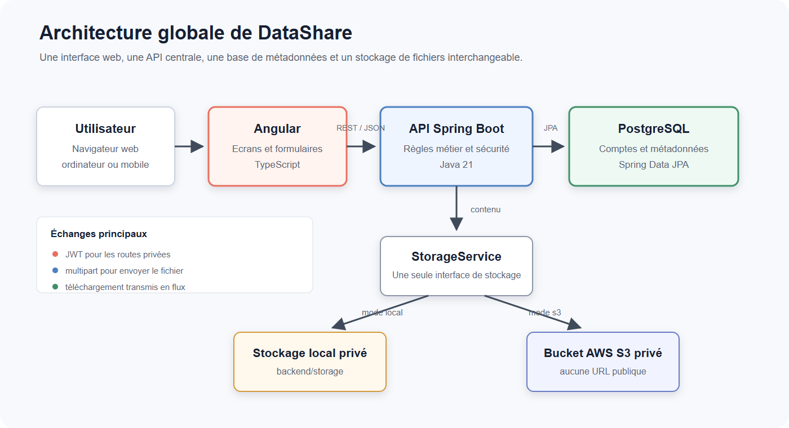
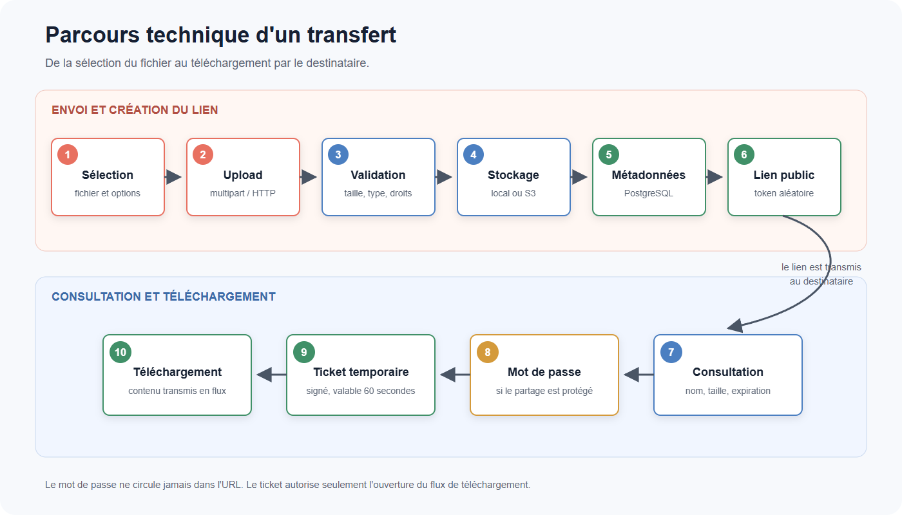
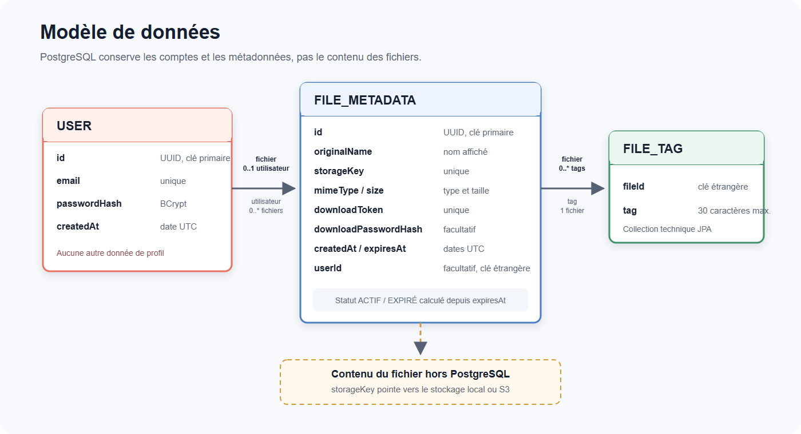
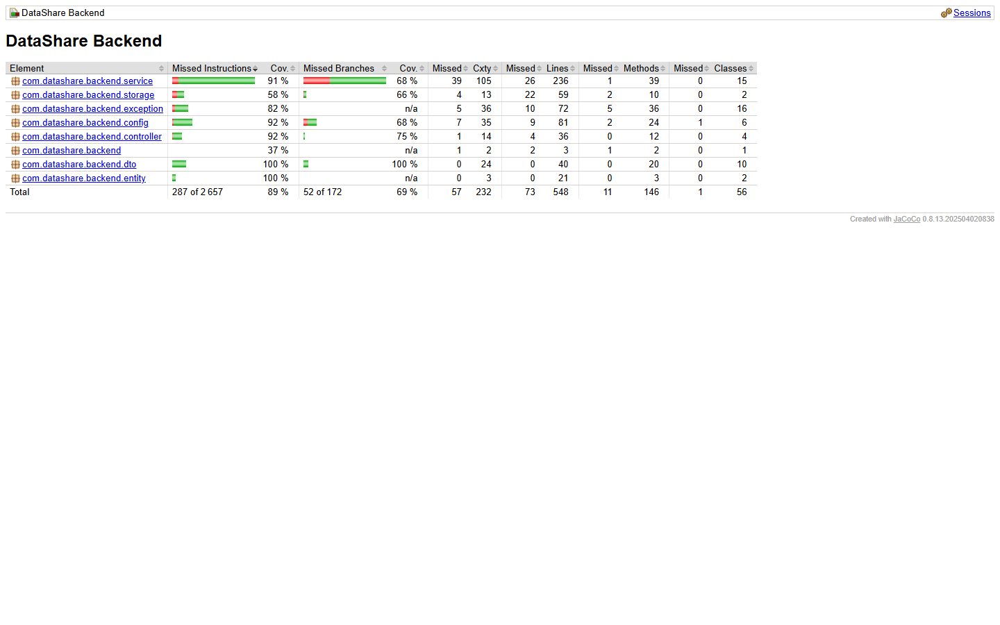
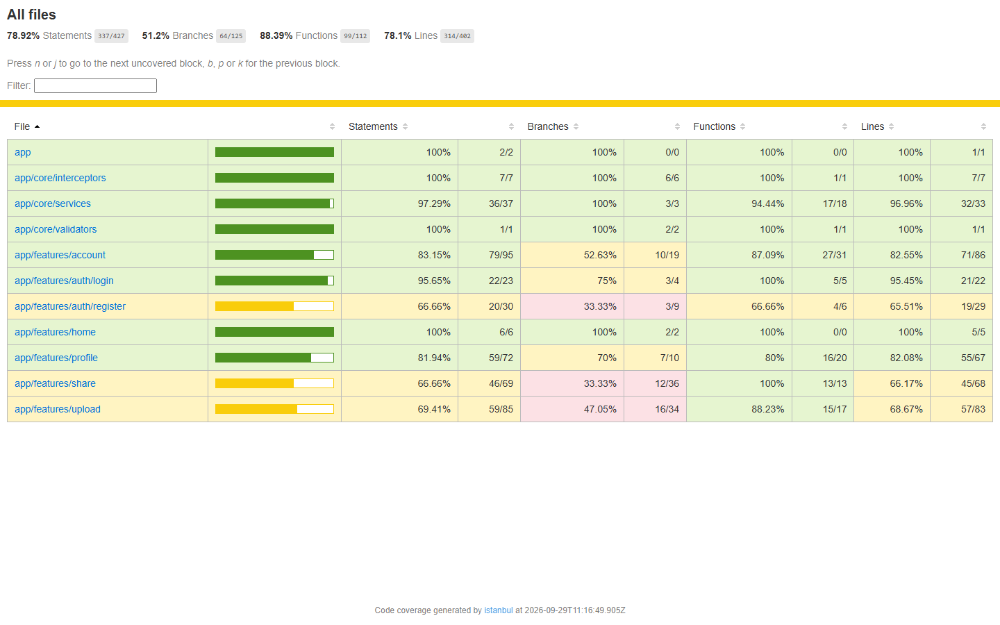

# DataShare — Documentation technique

- **Projet :** DataShare
- **Nature du document :** documentation technique
- **Dernière mise à jour :** 2 octobre 2026

DataShare est une application de transfert temporaire de fichiers. Ce document explique comment ses différentes parties travaillent ensemble, pourquoi les principales technologies ont été choisies et comment installer, vérifier et maintenir le projet. Il commence par une lecture simple de chaque sujet, puis apporte le niveau de détail nécessaire à une reprise technique.

## Sommaire

1. Architecture de l'application
2. Choix technologiques justifiés
3. Modèle de données
4. Documentation d'API
5. Sécurité et gestion des accès
6. Qualité, tests et maintenance
7. Processus d'installation et d'exécution
8. Utilisation de l'IA dans le développement

## Architecture de l'application

### Vue d'ensemble

- **Utilisateur / navigateur → Angular → API REST Spring Boot → PostgreSQL**
- **API Spring Boot → StorageService → stockage local ou bucket AWS S3 privé**



| Élément | Rôle principal | Échanges |
|---|---|---|
| Navigateur | Affiche l'application et déclenche les actions de l'utilisateur | Pages web, formulaires et téléchargement natif |
| Angular / TypeScript | Gère les écrans, les formulaires et les appels au backend | REST/JSON, JWT pour les routes privées et multipart pour l'upload |
| API Spring Boot / Java | Applique les validations, la sécurité et les règles métier | Réponses JSON et transmission des fichiers en flux |
| PostgreSQL | Conserve les comptes et les métadonnées des transferts | Accès par Spring Data JPA |
| StorageService | Donne au métier une interface unique pour le contenu des fichiers | Sélection du stockage local ou S3 au démarrage |

Le navigateur affiche l'interface Angular. Elle dialogue avec l'API, c'est-à-dire le point d'entrée du backend Spring Boot. Ce backend centralise l'authentification, les validations, les droits d'accès et les règles de partage. PostgreSQL conserve les comptes et les informations descriptives sur les fichiers ; leur contenu est enregistré via `StorageService`. Une seule solution de stockage, locale ou S3, est active pour une instance donnée. Si S3 est sélectionné et qu'une opération échoue, la requête échoue sans bascule silencieuse vers le disque local.

Les données ordinaires circulent en JSON, un format texte structuré. L'upload utilise `multipart/form-data`, adapté à l'envoi d'un fichier et de ses options dans la même requête. Pour le téléchargement, Angular demande d'abord une autorisation ; le navigateur utilise ensuite une URL temporaire pour recevoir progressivement le contenu. Le fichier n'est donc pas chargé en entier dans la mémoire d'Angular. En développement, Docker Compose utilise HTTP local ; une exposition distante nécessite HTTPS devant l'application.

Le backend suit le chemin classique `Controller → Service → Repository → PostgreSQL`. Les services métier appellent aussi `StorageService` pour les contenus. Le frontend est organisé par écrans fonctionnels (`auth`, `upload`, `share`, `account`, `profile`) et réutilise ses services API, modèles, garde et intercepteur. Cette séparation garde l'affichage côté Angular et place les décisions de sécurité côté Spring Boot.

### Organisation des projets

Le dépôt unique contient `frontend/` pour Angular, `backend/` pour Spring Boot, `docs/` pour la documentation et `quality/` pour les scripts et résultats de contrôle. `compose.yaml` se trouve à sa racine. Le backend sépare les routes HTTP (`controller`), les règles métier (`service`), les accès à la base (`repository`), les objets persistés (`entity`), les données de l'API (`dto`), le stockage (`storage`), la configuration technique (`config`) et les erreurs (`exception`). Les règles d'autorisation sont côté Spring, pas dans les composants Angular.

### Envoi, partage et téléchargement



1. L'expéditeur choisit un fichier et, éventuellement, une durée, un mot de passe de téléchargement et des tags s'il est connecté. Angular envoie le formulaire multipart à `POST /api/files`.
2. Spring vérifie les champs, génère une clé de stockage distincte du nom d'origine et un token public aléatoire. Le service stocke le contenu, puis enregistre les métadonnées dans PostgreSQL. Si l'écriture en base échoue après le stockage, il tente de nettoyer le contenu créé ; il n'existe pas de transaction atomique entre la base et le stockage.
3. Le destinataire ouvre la page de partage. `GET /api/shares/{token}` présente les informations publiques du fichier avant téléchargement. Un token absent ou supprimé renvoie `404` ; un fichier expiré encore identifiable renvoie `410`.
4. Le bouton de téléchargement déclenche `POST /api/shares/{token}/download`. Un mot de passe requis est contrôlé sans révéler s'il était manquant ou erroné. Après succès, le backend renvoie une URL interne avec un ticket signé valable au plus une minute.
5. Le navigateur appelle `GET /api/shares/{token}/content?ticket=…`. Spring lit un `InputStream` depuis le stockage et copie progressivement ses octets vers la réponse. Le navigateur gère la réception et l'enregistrement du fichier ; Angular ne garde pas un fichier de 1 Go dans un `Blob` JavaScript.

Le lien public n'accorde aucun droit de suppression. Les opérations privées retrouvent toujours l'utilisateur à partir du JWT. Le stockage S3 est vérifié au démarrage par un accès au bucket ; il reste privé et aucune URL S3 publique n'est envoyée au navigateur.

## Choix technologiques justifiés

| Élément | Technologie choisie | Alternatives possibles | Justification pour DataShare |
|---|---|---|---|
| Interface | Angular et TypeScript | React ou Vue | Le routeur, les formulaires et le client HTTP couvrent les parcours de l'application ; TypeScript explicite les données échangées avec l'API. |
| API et logique métier | Java 21 et Spring Boot | .NET Core, NestJS, Symfony/Laravel | Un monolithe permet de regrouper les règles de transfert, d'expiration et de droits d'accès dans un projet compréhensible et testable. |
| Base de données | PostgreSQL | MongoDB | Les relations entre utilisateurs, fichiers et tags, ainsi que les contraintes d'unicité, se représentent simplement en SQL. |
| Accès aux données | Spring Data JPA | SQL écrit à la main | Les repositories couvrent les recherches nécessaires sans couche de persistance supplémentaire. |
| Authentification | Spring Security et JWT | Session serveur | Le backend vérifie chaque requête privée ; Angular transmet le jeton Bearer. Aucun système de rôles n'est nécessaire. |
| Contenu des fichiers | `StorageService` local ou AWS S3 | Un seul stockage imposé | Le même métier fonctionne sans AWS pour le développement et avec un bucket privé lorsque S3 est configuré. |
| Contrat API | OpenAPI et Swagger UI | Documentation manuelle seule | Les routes et modèles restent consultables et essayables à partir du backend. |
| Tests et mesures | JUnit/MockMvc, JaCoCo, Jasmine/Karma, Playwright, axe-core et k6 | Tests manuels seuls | Ces outils vérifient les règles métier, les parcours réels, la couverture, l'accessibilité automatisable et la performance de l'upload. |
| Développement et exécution | Git, Maven, npm et Docker Compose | Installation manuelle de chaque service | Les dépendances sont déclarées dans `pom.xml` et `package-lock.json` ; Compose lance Angular, Spring Boot et PostgreSQL ensemble. |

Ces choix répondent aux besoins sans ajouter une infrastructure disproportionnée. DataShare reste une application unique : il n'utilise ni microservices, ni système intermédiaire de messages, ni rôles administrateur, ni plateforme de supervision dédiée. Les versions exactes sont définies dans `backend/pom.xml`, `frontend/package-lock.json` et `compose.yaml`. Un hébergement distant ou un pipeline CI/CD n'est pas nécessaire au fonctionnement local.

## Modèle de données

### Relations principales



- Un utilisateur peut posséder de zéro à plusieurs fichiers.
- Un fichier possède zéro ou un utilisateur : l'absence de propriétaire correspond à un upload anonyme.
- Un fichier peut comporter zéro à plusieurs tags.

| Table | Champs principaux | Contraintes utiles |
|---|---|---|
| `USER` | `id`, `email`, `passwordHash`, `createdAt` | Identifiant UUID ; email unique |
| `FILE_METADATA` | `id`, `originalName`, `storageKey`, `mimeType`, `size`, `downloadToken`, `downloadPasswordHash`, `createdAt`, `expiresAt`, `userId` | Clé de stockage et token uniques ; mot de passe et propriétaire facultatifs |
| `FILE_TAG` | `fileId`, `tag` | Collection de tags rattachée au fichier, sans entité métier autonome |

`USER` et `FILE_METADATA` sont les deux entités métier. `userId` est facultatif pour permettre l'upload anonyme. Les tags sont des chaînes rattachées au fichier par une collection JPA `@ElementCollection` ; `FILE_TAG` est une table technique, pas une entité métier autonome. L'email, la clé de stockage et le token de partage sont uniques. Les mots de passe sont conservés sous forme de hash. Ni chemin local, ni URL S3, ni état `ACTIVE`/`EXPIRED` ne sont stockés : cet état est calculé depuis `expiresAt`.

Les tags sont ajoutés pendant l'upload d'un utilisateur connecté et affichés dans son historique. Le filtrage par tag, indiqué comme facultatif dans les spécifications avancées, n'est pas implémenté.

### Rôle des champs

| Donnée | Rôle |
|---|---|
| `USER.email` | Identifiant de connexion unique ; aucun nom, téléphone ou adresse personnelle n'est demandé. |
| `USER.passwordHash` | Vérification de la connexion, sans conserver le mot de passe clair. |
| `FILE_METADATA.originalName`, `mimeType`, `size` | Affichage avant téléchargement et restitution du nom du fichier. |
| `storageKey` | Identifiant technique, généré par le serveur, utilisé par le stockage local ou S3. |
| `downloadToken` | Identifiant public non prédictible du lien de partage ; distinct de `storageKey`. |
| `downloadPasswordHash` | Présent seulement si l'expéditeur protège le téléchargement ; jamais retourné par l'API. |
| `createdAt`, `expiresAt` | Date d'envoi et limite de validité, calculées côté serveur et exprimées comme instants UTC. |
| `userId` | Référence du propriétaire authentifié ; valeur nulle pour un transfert anonyme. |
| `FILE_TAG.tag` | Valeur libre de 30 caractères au plus, sans doublon pour un même fichier. |

Un utilisateur peut posséder plusieurs fichiers ; chaque fichier possède au plus un propriétaire. Une suppression manuelle efface le contenu et sa ligne de métadonnées. La suppression du compte efface ses fichiers et leurs métadonnées avant le compte. La base et le disque/S3 ne participent pas à une même transaction distribuée : en cas d'échec du stockage pendant une suppression, l'API renvoie une erreur et conserve les données nécessaires pour réessayer.

La durée de partage est de 1 à 7 jours, avec 7 jours par défaut. À expiration, le téléchargement est bloqué immédiatement et la tâche de purge supprime le contenu. Pour un fichier appartenant à un compte, les métadonnées minimales restent dans l'historique afin d'afficher l'état « expiré » présent dans les maquettes ; elles sont supprimées avec le fichier ou le compte. Pour un transfert anonyme, la purge supprime aussi les métadonnées. Ce choix documenté résout une contradiction entre les maquettes et la règle de suppression immédiate de toutes les métadonnées dans les spécifications. Aucune table d'archive ni suppression logique n'est utilisée.

La tâche de purge se lance avec un délai fixe configurable, de 15 minutes par défaut. Son échec ne réactive pas le téléchargement : le contrôle de `expiresAt` intervient à chaque accès public. Une nouvelle exécution peut retenter une suppression physique inachevée. Les métadonnées des fichiers possédés ne disposent pas aujourd'hui d'une durée de conservation automatique supplémentaire ; l'utilisateur les retire par suppression du fichier ou du compte. Cette règle de conservation doit être clairement présentée, sans revendiquer une conformité RGPD certifiée.

## Documentation d'API

Le contrat détaillé est généré par OpenAPI à partir du backend. Lorsque l'application tourne, Swagger UI est accessible sur `http://localhost:8080/swagger-ui/index.html` et le contrat JSON sur `http://localhost:8080/v3/api-docs`. Swagger permet de consulter les routes, leurs paramètres, les réponses et les erreurs sans parcourir le code. Les principaux endpoints sont :

| Méthode et route | Accès | Objet et réponse principale |
|---|---|---|
| `POST /api/auth/register` | Public | Crée un compte ; `201` et utilisateur sans hash. |
| `POST /api/auth/login` | Public | Vérifie email et mot de passe ; `200` et JWT. |
| `GET /api/auth/me` | JWT | Récupère l'utilisateur actuellement authentifié. |
| `DELETE /api/users/me` | JWT | Supprime le compte après vérification du mot de passe courant ; `204`. |
| `POST /api/files` | Public ; JWT facultatif | Reçoit un fichier multipart, une durée, un mot de passe facultatif et des tags réservés aux comptes ; `201` et lien de partage. |
| `GET /api/files` | JWT | Liste uniquement les fichiers du propriétaire, actifs et expirés. |
| `GET /api/files/{id}` | JWT et propriétaire | Lit une métadonnée privée. |
| `DELETE /api/files/{id}` | JWT et propriétaire | Supprime contenu et métadonnées ; `204`. |
| `GET /api/shares/{token}` | Public avec lien | Affiche nom, type, taille, expiration et protection du partage. |
| `POST /api/shares/{token}/download` | Public avec lien | Vérifie le mot de passe éventuel ; retourne une URL de téléchargement temporaire. |
| `GET /api/shares/{token}/content?ticket=…` | Public avec ticket temporaire | Transmet le fichier en flux avec `Content-Disposition: attachment`. |

### Formats des requêtes et des réponses

L'inscription et la connexion reçoivent chacune un JSON `{ "email": "…", "password": "…" }`. Le mot de passe d'inscription doit contenir au moins 8 caractères et au plus 72 octets UTF-8 ; l'email doit être valide et unique. L'inscription répond par `UserResponse` (`id`, `email`, `createdAt`). La connexion répond par `LoginResponse` : `accessToken`, `tokenType: "Bearer"`, `expiresAt` et `user`. Le JWT reste valable une heure par défaut. Chaque validation vérifie que son identifiant `uid` et son email correspondent toujours au même compte en base ; supprimer puis recréer un compte avec le même email ne réactive donc pas un ancien jeton. `GET /api/auth/me` retourne `UserResponse` pour l'identité extraite du JWT. Pour supprimer son compte, le client envoie `DELETE /api/users/me` avec le JSON `{ "password": "…" }` ; la confirmation visuelle est gérée par Angular avant cet appel.

L'upload transmet un seul fichier par requête avec les parties suivantes :

| Partie multipart | Présence et règle |
|---|---|
| `file` | Obligatoire, non vide, 1 000 000 000 octets au maximum, nom et type autorisés. |
| `expirationDays` | Facultative ; entier de 1 à 7, valeur par défaut 7. |
| `password` | Facultative ; si présente et non vide, au moins 6 caractères et au plus 72 octets UTF-8. |
| `tags` | Facultative et répétable ; réservée à un upload authentifié, chaque valeur limitée à 30 caractères, sans doublon insensible à la casse. |

La réponse `FileResponse` inclut `id`, `originalName`, `mimeType`, `size`, `createdAt`, `expiresAt`, `passwordProtected`, `shareUrl`, `status` calculé et `tags`. Elle n'inclut jamais `storageKey` ou un hash. Le destinataire du lien reçoit moins d'informations : `SharedFileResponse` expose seulement nom, type, taille, expiration et indicateur de protection ; les tags et l'identité du propriétaire restent privés. La liste `/api/files` renvoie un tableau de `FileResponse`, éventuellement vide, trié par date d'envoi décroissante côté serveur. Angular applique les filtres visuels « Tous », « Actifs » et « Expirés » sur cette liste.

Pour télécharger un fichier non protégé, `POST /api/shares/{token}/download` reçoit `{}`. Pour un fichier protégé, il reçoit `{ "password": "…" }`. La réponse `DownloadAccessResponse` contient `downloadUrl` et la date `expiresAt` de cette autorisation temporaire. L'URL pointe vers le `GET` binaire interne avec un `ticket` signé. Cette dernière réponse comporte un type MIME approprié, une longueur et un en-tête `Content-Disposition: attachment` avec le nom du fichier. Le délai maximal Spring MVC du transfert est configurable par `DOWNLOAD_STREAM_TIMEOUT` (3600 secondes par défaut), indépendamment des 60 secondes de validité du ticket avant ouverture. Si le flux échoue après le début de l'envoi des octets, le navigateur constate une interruption ; le serveur ne peut plus remplacer ce flux par une erreur JSON.

### Erreurs et règles d'accès

Les appels de données utilisent JSON, l'upload utilise `multipart/form-data`, et la dernière route retourne du binaire. Les principales erreurs sont `400` pour une saisie invalide, `401` pour une autorisation refusée, `404` pour une ressource introuvable, `410` pour un partage expiré, `413` pour un fichier trop volumineux, `415` pour un type interdit et `503` si le stockage est indisponible. Sur un fichier protégé, un mot de passe absent ou incorrect produit la même réponse `401 DOWNLOAD_AUTH_FAILED`. Le backend déduit toujours le propriétaire du JWT, jamais d'un `userId` fourni par le client.

Les erreurs métier avant téléchargement suivent le format JSON `{ "code": "…", "message": "…", "fieldErrors": {} }`. Les champs invalides peuvent être détaillés dans `fieldErrors`, mais les secrets et traces techniques ne sont pas renvoyés. `401 DOWNLOAD_AUTH_FAILED` ne distingue pas un mot de passe requis absent d'un mot de passe erroné ; un ticket absent, altéré ou expiré renvoie `401 DOWNLOAD_ACCESS_INVALID`. Un fichier privé qui n'appartient pas au demandeur renvoie `404 FILE_NOT_FOUND`, comme un fichier inexistant, afin de ne pas confirmer son existence. Un transfert anonyme n'a aucune route de gestion privée.

## Sécurité et gestion des accès

### Authentification et propriété des ressources

Les mots de passe des comptes et des partages sont transformés par BCrypt en empreintes irréversibles. Spring Security vérifie la signature, l'émetteur et l'expiration des JWT, les jetons qui identifient un utilisateur connecté ; le secret de signature est fourni hors Git par `JWT_SECRET`. Angular conserve le jeton dans `sessionStorage` et l'ajoute aux routes privées. Aucun rôle administrateur n'est prévu. Le serveur contrôle l'appartenance avant de lister, lire ou supprimer un fichier. La suppression du compte exige le mot de passe courant et une double confirmation dans l'interface.

La sécurité de l'API est sans session serveur. L'inscription, la connexion, le dépôt de fichier et les routes de partage sont ouverts ; les autres routes exigent un JWT valide. Pour un upload, Spring utilise l'utilisateur authentifié s'il existe et laisse `userId` nul pour un visiteur. Angular ne transmet aucun identifiant de propriétaire. La connexion émet un nouveau jeton ; la déconnexion supprime sa copie locale. Comme aucun mécanisme de révocation ou de renouvellement n'est prévu dans la version actuelle, un jeton déjà émis reste techniquement valide jusqu'à son expiration, même après une déconnexion locale, tant que le compte existe. Sa suppression invalide l'association `uid` / email contrôlée par le serveur. Le stockage du JWT dans `sessionStorage` rend la prévention des injections de script particulièrement importante.

### Protection des fichiers et des échanges

Chaque lien de partage contient un token aléatoire non prédictible. Après une demande de téléchargement autorisée, le backend produit un ticket HMAC lié au partage et valable au plus 60 secondes. Sa signature doit utiliser la représentation Base64 URL canonique, ce qui permet de refuser une chaîne altérée même lorsqu'un autre encodage produirait les mêmes octets. Les mots de passe ne passent pas dans l'URL. Le bucket S3 reste privé. Les réponses de téléchargement désactivent le cache et demandent au navigateur de traiter le contenu comme une pièce jointe. Les erreurs API n'exposent pas de stack trace.

Le token de partage et le ticket apparaissent nécessairement dans les URLs utilisées pour le téléchargement. Le filtre de métriques groupe les routes dans ses journaux au lieu d'y inscrire les URLs complètes, et le journal d'accès Nginx standard est désactivé pour éviter d'y conserver ces valeurs. Le nom original n'est employé que pour l'affichage et `Content-Disposition` ; le stockage utilise une clé générée par le serveur. En mode S3, l'accès au bucket est contrôlé au démarrage ; les identifiants AWS viennent de l'environnement. La perte d'accès au stockage produit une erreur `503` et ne déplace pas silencieusement les fichiers vers un autre support.

Le serveur limite chaque fichier à 1 000 000 000 octets, autorise les formats usuels prévus et refuse notamment les extensions exécutables ou de script, ainsi que quelques signatures binaires exécutables. Le nom fourni par l'utilisateur n'est jamais utilisé comme chemin de stockage. Angular valide également les formulaires pour l'expérience utilisateur, sans remplacer les contrôles du serveur. L'API utilise un JWT Bearer transmis explicitement, sans cookie de session ; la protection CSRF est désactivée pour ce fonctionnement sans état. Angular échappe les données affichées, et les requêtes JPA sont paramétrées. Pour une exposition sur Internet, HTTPS doit être assuré par l'hébergement ; le Compose livré sert au développement local.

La politique des types accepte les images, vidéos, sons, archives et documents usuels. Elle combine une liste d'extensions autorisées, des types MIME explicitement interdits et la détection de quelques signatures d'exécutables Windows, Linux et macOS. Ce contrôle réduit le risque courant, mais n'est ni un antivirus ni une analyse des archives. La version actuelle ne limite pas automatiquement le nombre de tentatives de connexion ou de téléchargement. Ces limites sont détaillées dans `SECURITY.md`.

### Accessibilité et protection des données

La protection des données repose sur une collecte minimale (email et informations nécessaires aux transferts), une durée de partage courte, la purge du contenu expiré et la suppression du compte avec ses données. L'interface prend en compte les principes WCAG/RGAA : HTML sémantique, labels, clavier, focus et messages d'erreur accessibles. Les contrôles automatiques ne constituent pas une certification RGAA. Les choix et limites de sécurité sont détaillés dans `SECURITY.md`.

Les mots de passe ne sont jamais consignés en clair dans la base ni dans les journaux applicatifs. Les métadonnées privées ne sont renvoyées qu'au propriétaire. La suppression d'un compte élimine ses fichiers encore présents, ses métadonnées et son utilisateur si toutes les opérations de stockage aboutissent ; une erreur de stockage interrompt l'opération et permet de réessayer. Le contenu expiré n'est plus téléchargeable dès `expiresAt` même si la tâche de nettoyage physique n'a pas encore tourné. L'historique des fichiers possédés conserve leurs métadonnées jusqu'à une action de suppression : cette durée de conservation est un choix explicite de la version actuelle et doit être réévaluée selon le contexte d'exploitation.

La navigation utilise des contrôles HTML natifs lorsque c'est possible, des labels reliés aux formulaires, un focus visible et des messages annoncés aux technologies d'assistance. Les contrastes et le comportement mobile ont été revus ; axe-core vérifie les règles automatisables sur les écrans testés. Une conformité RGAA complète demanderait un audit manuel plus large et ne doit pas être revendiquée ici.

## Qualité, tests et maintenance

Les quatre fichiers de suivi demandés sont présents dans le dépôt :

| Fichier | Rôle et résultat documenté |
|---|---|
| `TESTING.md` | Plan et critères d'acceptation, commandes, 76 tests backend et 51 tests frontend réussis, 6 scénarios Playwright ; couverture de 86,68 % des lignes backend et 78,10 % frontend, au-dessus de l'objectif de 70 %. |
| `SECURITY.md` | Mesures de sécurité et scans de dépendances : `npm audit` sans vulnérabilité détectée ; Tomcat et Jackson corrigés après analyse du JAR ; rescan final sans vulnérabilité HIGH ou CRITICAL détectée. |
| `PERF.md` | Test k6 sur l'upload : 375 envois, 0 % d'erreur et p95 de 139,75 ms pour environ 112 kB en local ; tests de frontière à 1 Go et de cinq uploads parallèles ; métriques de logs et de navigateur. Le bundle Angular initial mesuré est de 278,61 kB bruts, sous l'avertissement fixé à 500 kB. |
| `MAINTENANCE.md` | Procédure de mise à jour des dépendances, contrôle mensuel proposé, réaction aux alertes critiques, correction de défauts, sauvegarde et vérification après intervention. |

Les tests backend isolent les services et contrôleurs ; un test d'intégration utilise H2 en compatibilité PostgreSQL. Les E2E traversent l'application complète avec PostgreSQL. Les tests de gros fichiers sont séparés des suites courantes car ils consomment plusieurs gigaoctets. Les mesures de performance sont celles de la machine locale utilisée pour les essais ; elles ne garantissent pas un débit identique sur S3 ou un hébergement distant. Les scénarios d'accessibilité automatisée ne remplacent pas une revue humaine complète.

### Plan de vérification

| Parcours ou règle | Vérification | Critère attendu |
|---|---|---|
| Inscription et connexion | Tests de service et HTTP, composants Angular, E2E | Email unique, mot de passe hashé, JWT valide, utilisateur récupérable par `/me`. |
| Upload et validation | Services, contrôleur, intégration, E2E | Un fichier autorisé est stocké et crée un lien ; un exécutable ou un fichier dépassant 1 Go est refusé. |
| Partage protégé | Services, HTTP, E2E | Mot de passe absent ou faux : même `401` ; mot de passe correct : ticket court, puis octets identiques au téléchargement. |
| Propriété, historique et suppression | Services, HTTP, E2E | Un compte ne voit ni ne supprime les fichiers d'un autre ; la suppression retire contenu et métadonnées. |
| Expiration et compte | Tests de service et E2E | Téléchargement refusé après expiration, purge du contenu, suppression complète des données du compte. |
| Interface et accessibilité | Tests Angular, Playwright et axe-core | Écrans utilisables sur mobile, erreurs compréhensibles, contrôles automatisables sans défaut signalé. |

Le seuil de 70 % porte sur les lignes dans le contrôle Maven ; la couverture des branches est affichée séparément et reste plus basse. Les chiffres seuls ne prouvent pas la qualité : les E2E vérifient les parcours complets et la réponse du navigateur.

**Couverture backend — rapport JaCoCo**



**Couverture frontend — rapport Karma/Istanbul**



Les rapports HTML détaillés sont régénérés localement par les suites de tests et ne sont pas versionnés.

### Résultats de sécurité et de performance

Le scan npm ne signale aucune vulnérabilité. Le scan des manifestes est également nul, mais ne résout pas toutes les versions Maven héritées. L'analyse du JAR avait détecté trois CVE sur Tomcat 11.0.24, puis une CVE sur les deux générations de Jackson après la première correction. Tomcat a été aligné sur 11.0.26 et les BOM Jackson sur 2.21.6 et 3.1.6. Les 76 tests backend et les 6 scénarios Playwright passent après ces mises à jour ; le rescan final du JAR ne détecte aucune vulnérabilité HIGH ou CRITICAL. `SECURITY.md` conserve le périmètre et les rapports utilisés.

Le scénario k6 teste `POST /api/files` avec cinq utilisateurs virtuels pendant 15 secondes. Il réalise 375 uploads de fichiers d'environ 112 kB, sans requête en erreur ; le p95 de l'upload est de 139,75 ms en local, sous le seuil choisi d'une seconde. Un test distinct accepte exactement 1 000 000 000 octets, vérifie le SHA-256 du téléchargement et refuse 1 000 000 001 octets en `413`. Le test de cinq uploads simultanés réussit les 15 envois répartis sur 100 Mo, 500 Mo et 1 Go. Les cinq clients de ce dernier test partagent un compte de performance : la mesure porte sur la concurrence de l'upload, pas sur cinq identités indépendantes.

Le frontend respecte son budget : 278,61 kB bruts pour le bundle initial contre un avertissement à 500 kB. La mesure locale du navigateur indique un First Contentful Paint d'environ 156 ms sur l'accueil. Le backend émet des lignes de métriques comme `event=http_request method=POST endpoint_group=files status=201 duration_ms=119 request_bytes=112486`. Elles permettent de suivre la durée, le volume et le statut sans consigner les tokens ou les mots de passe. `PERF.md` décrit les conditions exactes, les scripts et les limites de comparaison.

### Maintenance de l'application

Avant une livraison, la procédure prévoit les builds, suites backend/frontend, E2E et scans. Une revue mensuelle des dépendances est proposée pendant la période active, avec intervention plus rapide en cas d'alerte critique. Pour corriger un défaut, on le reproduit, on ajoute un test utile lorsque la règle doit être protégée, on applique un changement ciblé puis on rejoue les suites concernées. Une évolution de schéma ou de stockage nécessite une sauvegarde cohérente de PostgreSQL et du contenu ; changer de stockage actif ne migre pas les fichiers existants. `MAINTENANCE.md` décrit les commandes et les risques à surveiller.

## Processus d'installation et d'exécution

### Lancement complet avec Docker Compose

Le mode le plus simple requiert Docker Desktop et Docker Compose. Depuis la racine du dépôt, sous PowerShell, copier l'exemple de configuration seulement si `.env` n'existe pas déjà :

```powershell
Copy-Item .env.example .env
# Modifier JWT_SECRET dans .env avant le lancement.
docker compose up -d --build
```

Compose construit les images Angular et Spring Boot, démarre PostgreSQL et attend que cette base soit prête avant de lancer le backend. L'interface est accessible à `http://localhost:4200`, l'API à `http://localhost:8080`, Swagger UI à `http://localhost:8080/swagger-ui/index.html`. Le conteneur frontend transmet les appels `/api` au backend. Pour vérifier l'état ou examiner une erreur de démarrage :

```powershell
docker compose ps
docker compose logs --tail 100 backend frontend
```

Les principales variables sont :

| Variable | Usage |
|---|---|
| `POSTGRES_DB`, `POSTGRES_USER`, `POSTGRES_PASSWORD` | Nom, compte et mot de passe de la base créée par Compose. Les valeurs d'exemple sont réservées au développement local. |
| `JWT_SECRET` | Clé de signature obligatoire, d'au moins 32 octets ; une chaîne aléatoire ASCII de 32 caractères ou plus convient. |
| `DOWNLOAD_STREAM_TIMEOUT` | Délai maximal du transfert asynchrone côté Spring MVC ; `3600s` par défaut. |
| `STORAGE_TYPE` | `local` par défaut ou `s3` ; un seul mode est actif au démarrage. |
| `S3_BUCKET`, `S3_REGION` | Bucket privé et région, obligatoires si S3 est sélectionné. |
| `AWS_ACCESS_KEY_ID`, `AWS_SECRET_ACCESS_KEY`, `AWS_SESSION_TOKEN` | Identifiants AWS, ce dernier champ étant facultatif pour des identifiants temporaires. |
| `FRONTEND_PUBLIC_URL` | Adresse utilisée par le backend pour construire les liens de partage ; à ajuster si le port ou le domaine change. |
| `POSTGRES_PORT`, `BACKEND_PORT`, `FRONTEND_PORT` | Ports hôtes exposés par Compose. |
| `EXPIRATION_CLEANUP_DELAY_MS`, `DOWNLOAD_TICKET_EXPIRATION` | Fréquence de la purge et durée maximale du ticket de téléchargement ; valeurs d'exemple : 900 000 ms et une minute. |

`STORAGE_TYPE=local` utilise `backend/storage`, monté dans le conteneur backend. Pour S3, il faut renseigner les variables correspondantes et autoriser le compte AWS à accéder au bucket ; le backend vérifie l'accès au démarrage. Une erreur S3 n'entraîne aucun stockage local. Le fichier `.env` est ignoré par Git, contrairement à `.env.example` qui ne contient que des exemples. Aucun secret réel ne doit être ajouté à l'historique Git.

Pour arrêter sans supprimer les données : `docker compose down`. La commande `docker compose down -v` efface aussi le volume PostgreSQL local et doit être réservée à une remise à zéro voulue.

### Développement local et vérification

Le développement sans conteneur applicatif demande Java 21, Maven 3.9 et une version de Node.js compatible avec Angular 20 (20.x à partir de 20.19, 22.x à partir de 22.12 ou 24+), en plus de PostgreSQL lancé par Compose. Dans un terminal PowerShell ouvert à la racine :

```powershell
docker compose up -d postgres
cd backend
$env:JWT_SECRET = "remplacer-par-un-secret-aleatoire-de-32-octets-minimum"
mvn.cmd spring-boot:run
```

Dans un second terminal ouvert à la racine :

```powershell
cd frontend
npm.cmd ci
npm.cmd start
```

Le serveur Angular de développement transmet `/api` au backend via `proxy.conf.json`. Ses paramètres PostgreSQL par défaut correspondent à `.env.example`. Si les valeurs de la base ont été modifiées dans `.env`, définir aussi `DB_URL`, `DB_USERNAME` et `DB_PASSWORD` dans le terminal Maven : Docker Compose ne copie pas automatiquement les valeurs `.env` dans ce processus local.

Pour contrôler le code, exécuter `mvn.cmd verify` dans `backend` ; cette commande lance les tests et le seuil JaCoCo. Dans `frontend`, installer avec `npm.cmd ci`, lancer `npm.cmd run test:coverage -- --browsers=ChromeHeadless`, puis `npm.cmd run build`. Sous Windows, définir `CHROME_BIN` vers l'exécutable Microsoft Edge pour la suite Karma. Avec l'application complète en marche, `npm.cmd run test:e2e` exécute Playwright, également configuré pour Edge. Le `README.md` et `TESTING.md` conservent les variantes détaillées.

## Utilisation de l'IA dans le développement

### Tâche confiée et méthode de travail

US07, l'upload anonyme, est la user story choisie pour montrer concrètement l'utilisation de l'IA. La tâche consistait à ouvrir le parcours d'upload à un visiteur sans compte, côté backend et côté interface, en réutilisant les validations et le stockage existants. Le résultat attendu était précis : même route, mêmes contrôles et même lien de partage, mais aucun propriétaire, aucun tag, aucun historique personnel et aucun accès aux fonctions privées. L'assistance IA a aussi accompagné d'autres travaux de développement, de tests et de correction, toujours sous la validation du porteur du projet.

Les commits `feat(backend-ai): implement anonymous uploads for US07` et `feat(frontend-ai): implement anonymous upload interface for US07` portent l'implémentation initiale. Les commits `refactor(backend-us07): align upload service with project conventions` et `refactor(frontend-us07): align authentication state with project conventions` tracent la reprise. L'historique permet de comparer les deux états ; le libellé d'un commit indique l'étape du travail, pas l'auteur exact de chaque ligne.

### Revue et corrections

La supervision a vérifié que le client ne choisit jamais un propriétaire via un `userId`, que les routes privées restent protégées, que les tags sont refusés pour un transfert anonyme, et que l'expiration, la génération du lien et le stockage suivent les mêmes règles que l'upload authentifié. La reprise a harmonisé le service d'upload et l'état d'authentification Angular avec les conventions existantes. Les tests couvrent l'appel public, l'absence de propriétaire, la durée par défaut, le refus des tags avant stockage et l'accès aux écrans pour un visiteur.

Concrètement, la revue concerne `FileController` et `FileUploadService` pour le propriétaire facultatif, `SecurityConfig` pour ouvrir `POST /api/files` tout en protégeant les autres routes du groupe, `FileExpirationService` pour la purge anonyme, ainsi que les composants Angular d'accueil et d'upload. Les tests de contrôleur et de service vérifient notamment qu'un transfert anonyme crée une métadonnée sans utilisateur, avec sept jours par défaut, et que des tags anonymes sont rejetés avant l'écriture du contenu. Les tests frontend vérifient que le visiteur atteint le formulaire sans connexion tout en voyant une possibilité de se connecter. Les tests de régression sur l'upload authentifié et l'historique complètent cette revue.

### Apports et limites

L'IA a fourni une première implémentation ciblée de l'US07 et a accéléré ce parcours. Cette première version ne suivait pas partout les conventions de code et de gestion d'état du projet : elle a donc été relue puis remaniée. L'IA ne remplace ni la vérification des droits, ni le contrôle des effets en base et dans le stockage, ni les essais de bout en bout. Le fichier `architecture.md` détaille cette revue technique et l'historique Git montre les versions successives.
